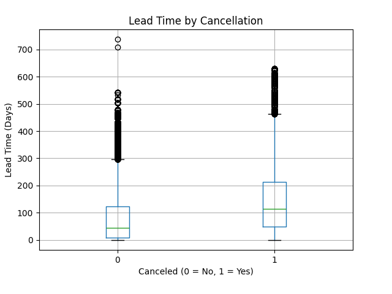

# Empty Rooms, Lost Revenue: Predicting Hotel Booking Cancellations

Using booking data to identify high-risk cancellations and help hotels reduce empty rooms and lost revenue.
https://github.com/jackiehelle/hotel-cancellation-predictivemodel
## The Business Problem

Last-minute booking cancellations are a major challenge for hotels. When guests cancel close to their arrival date, it can be difficult to refill those rooms in time, leading to lost revenue and unnecessary operational stress. By understanding which reservations are more likely to cancel, hotels can take proactive steps, such as sending reminders or adjusting booking policies, to reduce cancellations and better manage occupancy.

## The Data

This analysis uses the Hotel Booking Demand dataset, which includes information from over 119,000 hotel reservations. The data captures details such as how far in advance guests booked, room prices, length of stay, and basic guest information. By looking at patterns across these bookings, we can better understand what factors are associated with cancellations.

## Key Discoveries

- More than 1 in 3 Hotel Bookings End in Cancellation: Out of 119,390 reservations, roughly 37% were canceled, highlighting how common cancellations are and why predicting them is critical for protecting hotel revenue.
- Guests Who Book Months Ahead Are More Likely to Cancel: Bookings made far in advance showed noticeably higher cancellation rates compared to reservations made closer to the stay date, suggesting long-term travel plans are more likely to change.
- Guests Who Add Special Requests Are Less Likely to Cancel: Guests who included special requests—such as room preferences or amenities—were less likely to cancel their reservation, indicating that travelers who engage more with their booking tend to be more committed to their stay.
- Budget Bookings Show Slightly Higher Cancellation Risk: Lower-priced reservations showed somewhat higher cancellation rates, suggesting that guests choosing cheaper or more flexible options may be less committed to their booking.

## Visualizing the Story

Bookings made far in advance are significantly more likely to be canceled than those made closer to the stay date. This suggests that reservations made months ahead carry greater uncertainty and risk for hotels. Identifying these high lead-time bookings early gives hotels an opportunity to send reminders, confirm plans, or adjust inventory strategies to reduce lost revenue.

## Prediction Model

The model correctly predicts booking outcomes about 68% of the time, meaning the hotel can identify many reservations that are at higher risk of canceling before the stay date. In practical terms, this allows the hotel to flag potential cancellations early and follow up with guests through reminders or flexible rebooking options. Even catching a portion of these cancellations in advance could help the hotel refill rooms sooner and reduce the revenue lost from empty rooms.

## Recommendations

1. **Implement automated reminder emails for bookings made far inadvance:** The hotel should implement automated reminder emails or confirmation requests for guests who book their stays far in advance, such as 30–60 days before arrival. The analysis showed that reservations with longer lead times were more likely to be canceled than bookings made closer to the stay date. Encouraging guests to confirm their plans earlier could help identify cancellations sooner and allow the hotel to resell those rooms. If reminder emails reduce cancellations by even 10–15%, the hotel could recover revenue that would otherwise be lost from last-minute cancellations.

2. **Encourage guests to personalize their reservation with special requests:** The hotel should also encourage guests to personalize their reservations by adding special requests during the booking process, such as preferred room location, amenities, or early check-in options. The data showed that guests who made special requests were less likely to cancel their reservations, suggesting that travelers who engage more with their booking are more committed to their stay. Prompting guests to add preferences during booking could strengthen this engagement. Increasing personalization could reduce cancellations by approximately 5–10%, helping improve overall occupancy rates.

3. **Adjust policies for lower-priced or flexible bookings** The hotel should review pricing or deposit policies for lower-priced or highly flexible bookings. The exploratory analysis suggested that lower-priced reservations were slightly more likely to be canceled, indicating that guests choosing these options may be less committed to their stay. Introducing small deposits or offering incentives for non-refundable bookings could encourage guests to keep their reservations. Even a 5–10% reduction in cancellations among these bookings could help stabilize revenue and improve room utilization during high-demand periods.

## Tools & Techniques

Python | Pandas | Scikit-Learn | Matplotlib | Seaborn | Gaussian Naive Bayes | Google Colab

---

*This project was completed as part of ISOM 835: Predictive Analytics at Suffolk University\'s
Sawyer Business School.*

