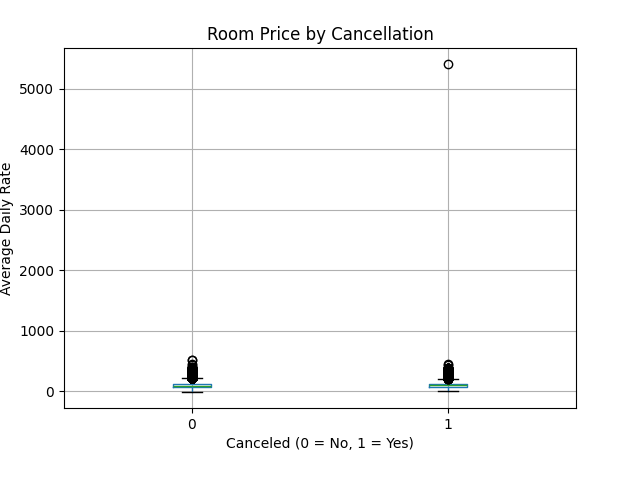

# Run this cell to display the README template — then copy the printed output

readme_template = '''
Empty Rooms, Lost Revenue: Predicting Hotel Booking Cancellations

Using booking data to predict which reservations are most likely to cancel so hotels can minimize lost revenue and plan occupancy more effectively.

The Business Problem

Last-minute booking cancellations are a major challenge for hotels. When guests cancel close to their arrival date, it can be difficult to refill those rooms in time, leading to lost revenue and unnecessary operational stress. By understanding which reservations are more likely to cancel, hotels can take proactive steps—such as sending reminders or adjusting booking policies—to reduce cancellations and better manage occupancy.

The Data

This analysis uses the Hotel Booking Demand dataset, which includes information from over 119,000 hotel reservations. The data captures details such as how far in advance guests booked, room prices, length of stay, and basic guest information. By looking at patterns across these bookings, we can better understand what factors are associated with cancellations.

Key Discoveries

- More Than 1 in 3 Hotel Bookings End in Cancellation: Out of 119,390 reservations, roughly 37% were canceled, highlighting how common cancellations are and why predicting them is critical for protecting hotel revenue.
- Guests Who Book Months Ahead Are More Likely to Cancel: Bookings made far in advance showed noticeably higher cancellation rates compared to reservations made closer to the stay date, suggesting long-term travel plans are more likely to change.
- Guests Who Add Special Requests Are Less Likely to Cancel: Guests who included special requests—such as room preferences or amenities—were less likely to cancel their reservation, indicating that travelers who engage more with their booking tend to be more committed to their stay.
- Budget Bookings Show Slightly Higher Cancellation Risk: Lower-priced reservations showed somewhat higher cancellation rates, suggesting that guests choosing cheaper or more flexible options may be less committed to their booking.

Visualizing the Story

*[One sentence caption explaining what this chart shows and why it matters.]*

## Prediction Model

[2-3 sentences. How well can we predict the outcome? Translate accuracy into real-world terms.]

<!--
Tip: Translate model metrics into business impact.
Instead of "The model achieved 78% accuracy..."
Try: "Our model correctly flags 8 out of 10 at-risk bookings, giving the hotel front desk team
enough lead time to proactively reach out and offer flexible rebooking options."
-->

## Recommendations

1. **[Action]:** [Why this action, based on your data. Estimated impact.]
2. **[Action]:** [Why this action, based on your data. Estimated impact.]
3. **[Action]:** [Why this action, based on your data. Estimated impact.]

## Tools & Techniques

Python | Pandas | Scikit-Learn | Matplotlib | Seaborn | Gaussian Naive Bayes | Google Colab

---

*This project was completed as part of ISOM 835: Predictive Analytics at Suffolk University\'s
Sawyer Business School.*
'''

print(readme_template)

<!--
Tip: Write findings as "headlines" a newspaper editor would approve.
Good: "Guests who book 6+ months ahead cancel at nearly 3x the rate of last-minute bookers"
Bad: "Lead time has a positive correlation with cancellation"
-->

## Visualizing the Story

*[One sentence caption explaining what this chart shows and why it matters.]*
# Run this cell to display the README template — then copy the printed output

readme_template = '''
Empty Rooms, Lost Revenue: Predicting Hotel Booking Cancellations

Using booking data to predict which reservations are most likely to cancel so hotels can minimize lost revenue and plan occupancy more effectively.

The Business Problem

Last-minute booking cancellations are a major challenge for hotels. When guests cancel close to their arrival date, it can be difficult to refill those rooms in time, leading to lost revenue and unnecessary operational stress. By understanding which reservations are more likely to cancel, hotels can take proactive steps—such as sending reminders or adjusting booking policies—to reduce cancellations and better manage occupancy.

The Data

This analysis uses the Hotel Booking Demand dataset, which includes information from over 119,000 hotel reservations. The data captures details such as how far in advance guests booked, room prices, length of stay, and basic guest information. By looking at patterns across these bookings, we can better understand what factors are associated with cancellations.

Key Discoveries

- More Than 1 in 3 Hotel Bookings End in Cancellation: Out of 119,390 reservations, roughly 37% were canceled, highlighting how common cancellations are and why predicting them is critical for protecting hotel revenue.
- Guests Who Book Months Ahead Are More Likely to Cancel: Bookings made far in advance showed noticeably higher cancellation rates compared to reservations made closer to the stay date, suggesting long-term travel plans are more likely to change.
- Guests Who Add Special Requests Are Less Likely to Cancel: Guests who included special requests—such as room preferences or amenities—were less likely to cancel their reservation, indicating that travelers who engage more with their booking tend to be more committed to their stay.
- Budget Bookings Show Slightly Higher Cancellation Risk: Lower-priced reservations showed somewhat higher cancellation rates, suggesting that guests choosing cheaper or more flexible options may be less committed to their booking.

Visualizing the Story

*[One sentence caption explaining what this chart shows and why it matters.]*

## Prediction Model

[2-3 sentences. How well can we predict the outcome? Translate accuracy into real-world terms.]

<!--
Tip: Translate model metrics into business impact.
Instead of "The model achieved 78% accuracy..."
Try: "Our model correctly flags 8 out of 10 at-risk bookings, giving the hotel front desk team
enough lead time to proactively reach out and offer flexible rebooking options."
-->

## Recommendations

1. **[Action]:** [Why this action, based on your data. Estimated impact.]
2. **[Action]:** [Why this action, based on your data. Estimated impact.]
3. **[Action]:** [Why this action, based on your data. Estimated impact.]

## Tools & Techniques

Python | Pandas | Scikit-Learn | Matplotlib | Seaborn | Gaussian Naive Bayes | Google Colab

---

*This project was completed as part of ISOM 835: Predictive Analytics at Suffolk University\'s
Sawyer Business School.*
'''

print(readme_template)
